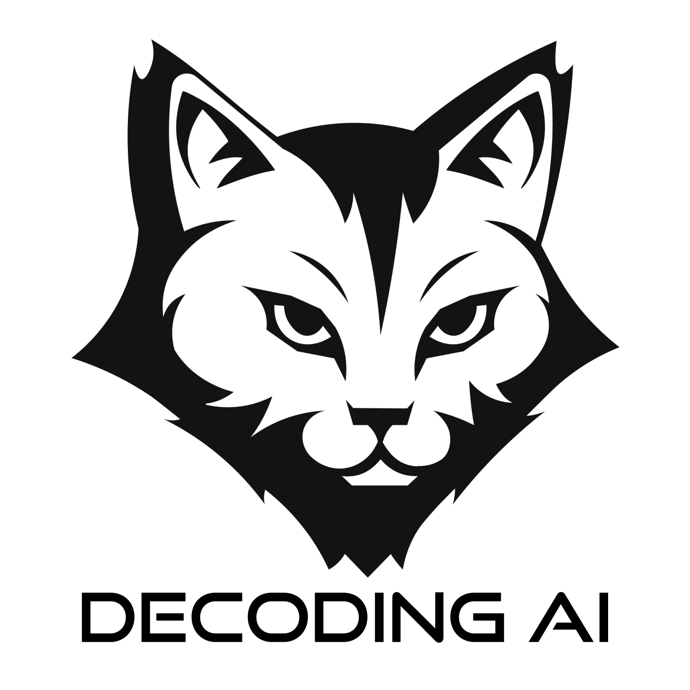

# Paul Iusztin

**`Senior AI Engineer • Founder @ Decoding AI • Author @ LLM Engineer’s Handbook ~ I ship AI products and teach you about the process.`**

 

-----

## 👋 About Me

Hi there

I’m the author of the bestseller LLM Engineer’s Handbook, lead instructor of the Agentic AI Engineering course, and founding AI Engineer of a San Francisco startup.

With 10+ years of experience and 20 apps shipped, I teach AI Engineering end-to-end: from idea and data collection to production, monitoring, and evaluation. My focus is on the software patterns and infrastructure systems built to thrive in an AI-dominated future.

My goal is to help engineers escape PoC purgatory and 10x their AI Engineering skills.

## 🔗 Socials

## 🤝 Let's collaborate!

I'm always excited to collaborate with other AI enthusiats and creators. Have an idea or working on something cool? Let's talk!

📧 Reach out at [p.b.iusztin@gmail.com](mailto:p.b.iusztin@gmail.com)

-----

<table>
  <tr>
    <td width="30%">
      
    </td>
    <td width="70%">
      

        <h2>Founder @ the Decoding AI Magazine</h2>
        
Weekly hub for learning how to design, build, and ship production-grade AI systems. End-to-end. From idea to production. Every Tuesday, straight to your inbox.

      

    </td>
  </tr>
</table>

## 🗞️ Join the Decoding AI Magazine

