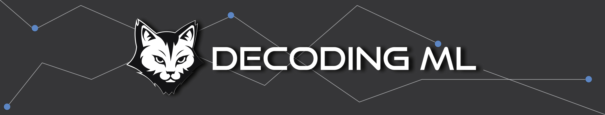
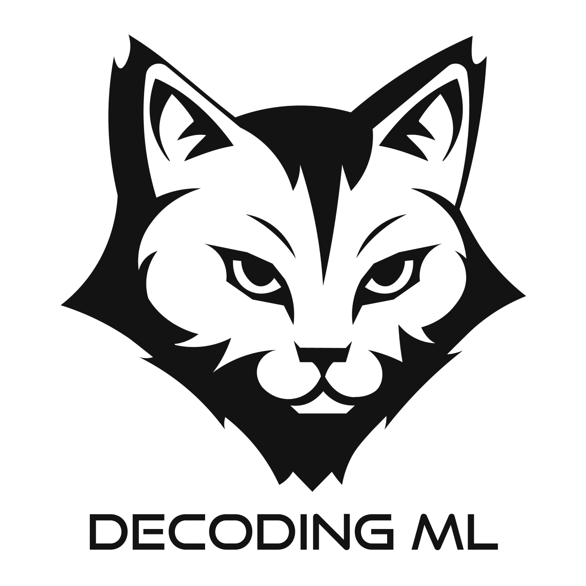

# Paul Iusztin

**`Senior Machine Learning Engineer • MLOps • Founder @ Decoding ML ~ Posts and articles about building production-grade AI systems.`**

 

### My passion is to:

* Design and implement production AI and GenAI systems using MLOps and Software Engineering best practices.

* Teach people about the process.

-----

## Socials

 
 
 

**Email:** p.b.iusztin@gmail.com

-----

<table>
  <tr>
    <td>
      
    </td>
    <td>
        <h2> Founder @ Decoding ML </h1>
        <h3> → A channel for proven content on designing, coding, and deploying production-grade AI, GenAI, and information retrieval systems—built with ML systems, MLE, and MLOps best practices </h2>
    </td>
</table>

### [Join Decoding ML](https://decodingml.substack.com/) for courses, articles and tutorials on production-grade AI and GenAI systems at:

