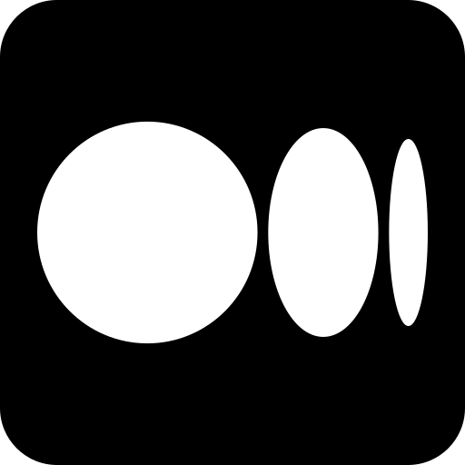

# Paul Iusztin

**`Senior Machine Learning Engineer • MLOps • Founder @ Decoding ML ~ Posts and articles about building production-grade ML/AI systems.`**
 
 

What do I do?

* Design and implement production AI/ML systems using MLOps best practices.

* Teach people about the process.

🔗 More about me at https://pauliusztin.me.

------

<table>
  <tr>
    <td>
      
    </td>
    <td>
    Founder @ Decoding ML  
    → A channel for battle-tested content on designing, coding, and deploying production-grade ML & MLOps systems.
    </td>
  </tr>
</table>

* [Weekly newsletter](https://decodingml.substack.com/)
* [Blog](https://medium.com/decodingml)
* [GitHub](https://github.com/decodingml)

-----

### Socials

 
 
 

-----

🎨 Creating content takes me a lot of time. If you enjoyed my work, consider supporting me by [**buying me a coffee.**](https://www.buymeacoffee.com/pauliusztin)
